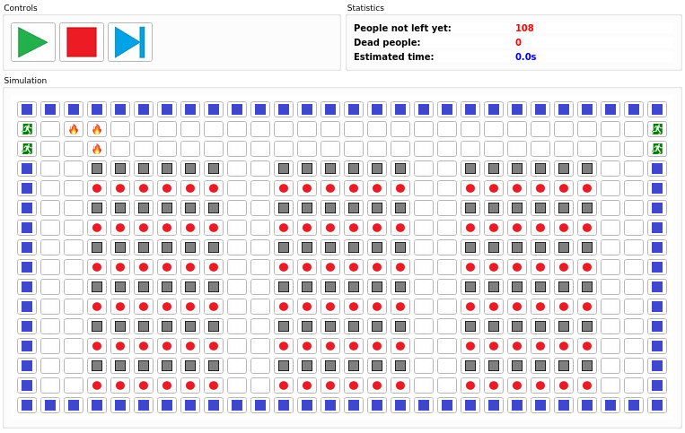
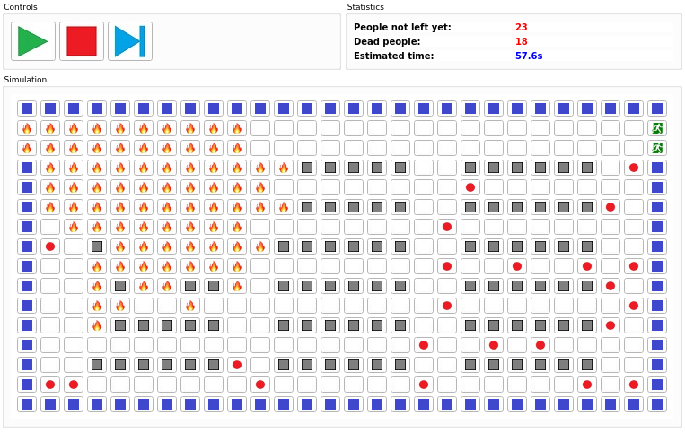
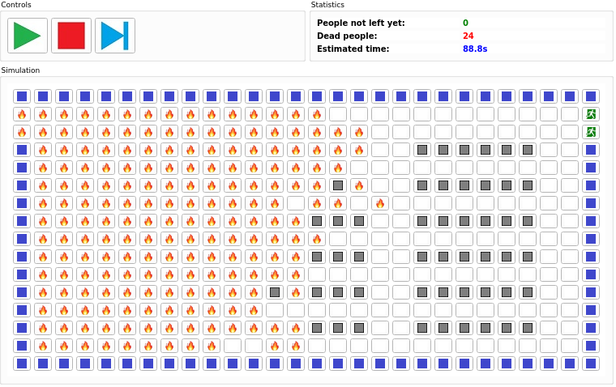

<h3 align="center">EmergencyEvacuationSimulator</h3>

	This tool has been created as a part of course 'Modelling and simulations'.
	 
	We were given a task to create a simulation based on cellular systems.
	 
	So we have chosen simulation of evacuation in the cinema.
	 
	Simulation measures number of people in the simulation, number of people which died during the simulation and estimated time.

## Dependencies

 - GUI Framework Qt

## About the tool

 - Tool may be used within the terminal using the `make` command
 - Tool has GUI, which allows us to control simulation, visualize simulation & see statistics using `make gui` command
 - Simulation can be adjusted using the command line arguments (e.g.: increase crowd-influence, increase fire spread, etc.). See help `-h`
 - See the doc/doc.pdf for more infos (czech) or documentation of the code (english)

## Examples

 - Running GUI version using the default arguments
 - Build target `make gui`
 - Run simulation `./evactuation`
 - In the GUI, you may add/remove exit by left/right clicking on the cell, same for adding/removing fire on the cell
 - Run the simulation using green button, stop simulation using red simulation, make one step of simulation using blue button
 - See statistics for results
 - More images in doc/doc.pdf & doc/experiments

 Inline-style: 

 Inline-style: 

 Inline-style: 

## Facts

 - People will try to get to the closest exits
 - People will run away from the fire
 - According to crowd-influence, people will run same direction as others
 - Random distribution of probability (people won't go straight to the exits)
 - Its just simulation and NOBODY gets hurt (so you may do whatever you want with people in simulation, eg. let'em all burn, or save'em all)